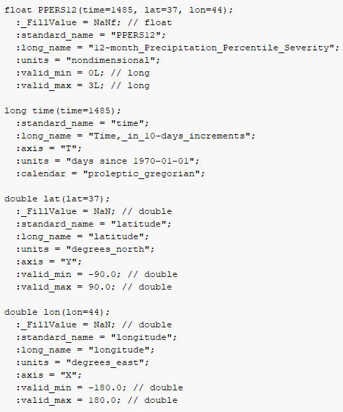
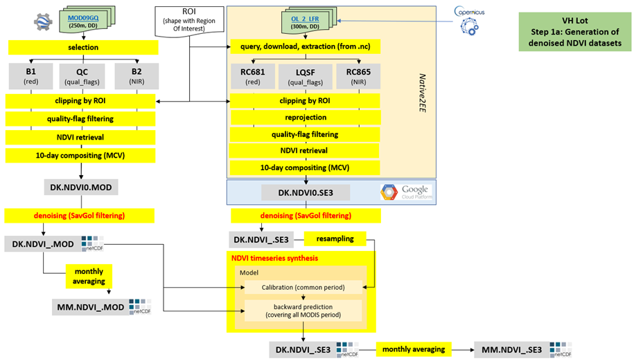
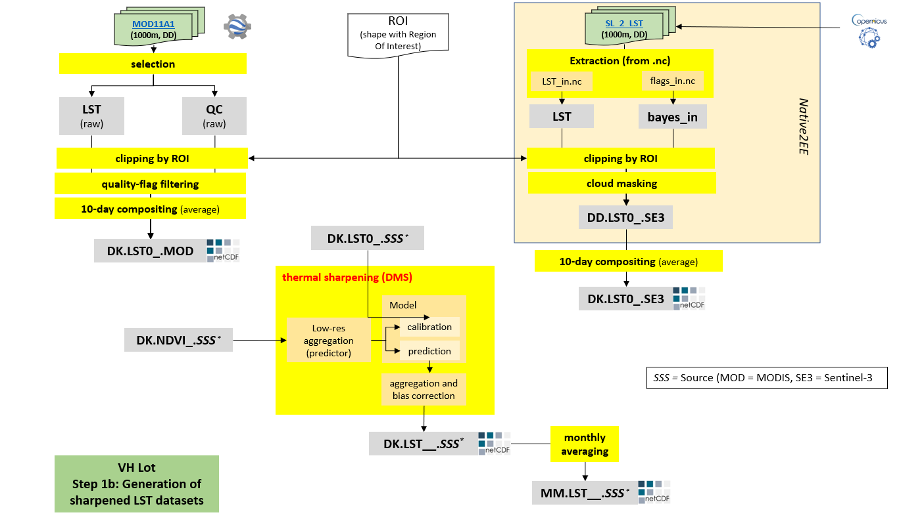
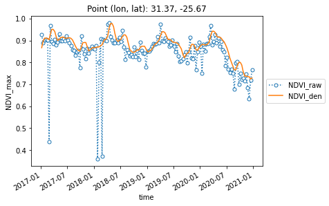
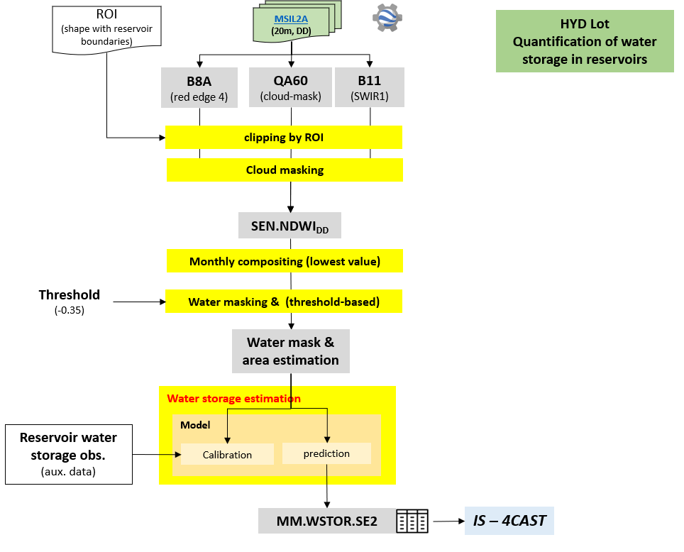

BACKGROUND
==========

Executive summary 
-----------------

InfoSequia is an operational expert-analysis climate service with enhanced drought monitoring and seasonal forecasting capabilities by combining EO-climate data, and cloud geoprocessing client-tailored and machine learning techniques.

It was designed as a Drought Early Warning System (DEWS) to support disaster risk management at the basin and agricultural district levels. InfoSequia provides timely and contextualized data in the form of: 1) warnings of ongoing drought hazard (severity and spatial extension) and, 2) impact-based seasonal forecasts for crop yield and water supply. Data generated by InfoSequia can be accessed through multiple channels, i.e.: a) FTP or API-authentication protocol/channel, or b) a user-friendly web mapping interface. Also, outcomes can be easily ingested in PaaS/SaaS solutions already available in the market.

InfoSequia is characterized by its modularity and robustness, its flexibility and the quality of its outcomes (e.g. data with enhanced spatial and temporal resolutions, short revisit times). The operational service is very suitable for being coupled with other monitoring or forecasting technologies, or helping different market segments by addressing their needs, including:

- more efficient and transparent management of droughts, by enabling the early generation of warnings and alerts and the justification of preventive actions. This would mean in time and cost savings by simplifying and systematization reporting commitments or avoiding the onset of severe impacts on the population (useful for water management authorities, and disaster response and management agencies)

- adjustment of irrigation quotas and restrictions at the district or province level (agricultural sector – irrigation boards and extension officers).

- early detection of scheme failures (e.g. crop yield damages and water shortage events) which allows a more accurate planning of financial and insurance needs, and to optimize the allocation of human resources for field-based inspections (insurance/re-insurance).

- triggering of ex-ante cash transfer and voucher programmes (civil defence and response organizations)

		
Fit-for purpose 
---------------

Droughts and water stress are complex risks affecting millions of people and contributing to food insecurity, poverty and inequality (UNDRR, 2021). Economic losses in the last century have been estimated in >250 billion US$, and almost 700k deaths were reported in Africa in this period (WMO, 2021). Climate change will exacerbate the recurrence and severity of drought and water stress events.

Around 11 water stress hotspots have been detected worldwide, 4 of which are located in Africa.

Despite its proven usefulness and effectiveness as key tools for drought management and adaptation, the use of DEWSs and the inclusion of satellite data into them is being hampered by the existence of technological, and institutional and social barriers. According to a recent WMO’s report (WMO, 2021), around 60% of its country members lack the full capacity needed to provide climate services for water, being specially acute for those services centered in monitoring and forecasting droughts and their potential impacts.

Technological barriers make difficult to reach enough specificity and reliability to map and early detect local patterns of drought hazard and risk. Sometimes these barriers, which inhibit the development of more local-oriented and user-tailored DEWS, are related with the lack of: 1) -computing- capabilities to deal with increasingly demanding needs of higher spatial resolutions, temporal updating frequencies, or accuracy and reliability metrics, 2) ground observations of drought impact required to validate EO- and model-based indicators, or to train and test forecasting models, or 3) specific standards for the development, maintenance and qualification of climate services is also.

Institutional and social barriers rest on the not enough trustiness on DEWS due to: 1) lack of understandable and transparent indicators of warning/alert, or difficulty to reach those indicators through intuitive and interactive platforms able to simplify the access, sharing and communication of relevant data, 2) the permanent feeling of being in a permanent status of alert which strongly reduces the trustness of the forecast.

InfoSequia aims to break down these barriers and fit the needs by:

- Adopting a cloud processing architecture and the most advanced computing and modelling techniques.

- Providing a new suite of meteorological drought indices, including Precipitation percentiles, Standardized Precipitation Index (considered by the World Meteorological Organization as the reference drought index), and the Standardized Precipitation-Evaporation Index (best suited for drylands)

- Providing a suite of singular and blended vegetation health indices derived from NASA and ESA missions

- Assimilating agrometeorological ground observations retrieved from local and national networks for calibration and verification purposes.

- Quantifying the severity and persistence of drought hazard by adopting short (1, 3 month) and long-term (6, 12 months) timescales.

- Improving the spatial and temporal resolution traits for InfoSequia products (dekad-based TR, and from 5 km to 100 m. of SR depending on user needs)

- Sharing or integrating InfoSequia outcomes through user-friendly front-end platforms or standard communication channels.

Value proposition 
-----------------

-  Timely and regular monitoring of drought status and intensity through generation of multi-source and multi-sensor products

-  Seasonal outlooks of crop yield and water supply failures, plus performance and uncertainty metrics to support making decision (under development)

-  Flexibility, modularity, and user/site-tailored designed according to customer needs and requirements

-  Front-end webmapping, data query from API, integration in SaaS/PaaS solutions (data centers)

Table 1. Comparative advantage

+----------------------------------------------------------------------+
| Local specificity, modular architecture, cloud computing solution,   |
| multi-source denoised indices, high spatial and temporal resolution, |
| front-end user friendliness, ease of integration in SaaS/PaaS,       |
| tailored support and training                                        |
+----------------------------------------------------------------------+

Long-term solution (with regular maintenance and upgrades + technical support)

InfoSequia-4CAST aims to meet the needs of water management authorities and humanitarian-aid agencies by providing actionable, seasonal-scale outlooks of drought-induced crop yield and water supply failures, with the required level of accuracy, reliability, and location-specificity.

Water and food security are at risk in many places around the world, at present and even more so in the future, with significant economic and humanitarian consequences. Risk managers and decision-makers (e.g. water management authorities and humanitarian-aid agencies) can more effectively prevent harmful drought impacts if timely information is available on how the system is affected, and the probability of a system failure.

InfoSequia-4CAST combines historical and up-to-date observations of satellite-based meteorological and agricultural drought indices with climate variability indices, to generate seasonal outlooks of water supply and crop yield failure alerts. These impact-based indicators are computed using a simple, robust and easily understandable statistical forecasting-modelling framework. By making use of multi-sensor, state-of-the art satellite data fully integrated with predictive models, InfoSequia-4CAST provides locally-specific, 3-6 month outlooks and warnings of crop yield and water supply failures to end users through a simple, intuitive user interface.

The product is tailored to the needs of water managers who are looking to alleviate and mitigate impacts of forthcoming drought periods by taking strategic water management decisions, and humanitarian NGOs aiming to trigger ex-ante cash transfers with policyholders and farmer communities.

Key Performance Indicators
--------------------------

The quality of the seasonal forecasts of InfoSequia is evaluated according its capability to address the needs and technical gaps identified by users. Definition and quantification of these needs are continuously evaluated through specific surveys and/or regular meetings with target user segments, including river basin authorities and humanitarian NGO’s. These needs are translated into several target KPIs and metrics which refer to aspects as geographical scale, forecasting lead time(s), update frequency, latency, reliability and access to the system outcomes (Table 2).

Table . KPIs used for InfoSequia forecast products

+----------------------+----------------------+----------------------+
| **Requirement        | **User req.          | **Description of     |
| Description**        | indicated**          | criticality**        |
+----------------------+----------------------+----------------------+
| **Lead time**        | Flexible: 2-6 months | It is the length of  |
|                      | ahead                | time between the     |
|                      |                      | issuance of a        |
|                      |                      | forecast and the     |
|                      |                      | occurrence of the    |
|                      |                      | phenomenon that is   |
|                      |                      | predicted.           |
+----------------------+----------------------+----------------------+
| **Spatial context**  | Sub-basin            | Spatial units with a |
|                      |                      | large and clear      |
| (water management)   | River basin          | water supply-demand  |
|                      |                      | system: sub-basins   |
|                      |                      | and river basins     |
+----------------------+----------------------+----------------------+
| **Spatial context**  | District             | Spatial units with   |
|                      |                      | homogeneous climate  |
| (food security)      |                      | forcings and         |
|                      |                      | cropping systems,    |
|                      |                      | fitting the area of  |
|                      |                      | interest of the end  |
|                      |                      | user                 |
+----------------------+----------------------+----------------------+
| **Update frequency** | Monthly              | The update frequency |
| **(refresh rate)**   |                      | should be in line    |
|                      |                      | with time scales     |
|                      |                      | associated with      |
|                      |                      | relevant             |
|                      |                      | agro-/hydro-         |
|                      |                      | climatological       |
|                      |                      | processes and end    |
|                      |                      | users’ opportunities |
|                      |                      | to act               |
+----------------------+----------------------+----------------------+
| **Latency            | Max. 3 days          | This is the time     |
| (timeliness)**       |                      | delay between the    |
|                      |                      | date at which an     |
|                      |                      | observation is taken |
|                      |                      | and the date when    |
|                      |                      | the alert is         |
|                      |                      | provided to the      |
|                      |                      | end-user             |
+----------------------+----------------------+----------------------+
| **Reliability**      | Varying from a       | The ability to       |
|                      | balanced probability | detect hits (true    |
|                      | for drought          | positives) and       |
|                      | detection and false  | correct rejections   |
|                      | alarm (50%-60%), to  | (true negatives). In |
|                      | a high probability   | this case, accuracy  |
|                      | of drought detection | is defined as a      |
|                      | at the expense of    | balance between      |
|                      | false alarms (>80%). | sensitivity (hit     |
|                      |                      | rate) and            |
|                      |                      | specificity (correct |
|                      |                      | rejection rate).     |
|                      |                      | This balance should  |
|                      |                      | be mutable according |
|                      |                      | to user needs, with  |
|                      |                      | some applications    |
|                      |                      | requiring high       |
|                      |                      | sensitivity (where   |
|                      |                      | costs of impact are  |
|                      |                      | high and cost of     |
|                      |                      | action is low) and   |
|                      |                      | others high          |
|                      |                      | specificity (where   |
|                      |                      | costs of action are  |
|                      |                      | high).               |
+----------------------+----------------------+----------------------+
| **Auxiliary          | - Predictors used    | Additional           |
| information**        | for forecasting      | information          |
|                      |                      | delivered with the   |
|                      | - Metrics of         | InfoSequia(-4CAST)   |
|                      | forecast uncertainty | information to aid   |
|                      |                      | end users in its     |
|                      |                      | interpretation       |
+----------------------+----------------------+----------------------+
| **Access to          | Pushed alerts        | System ability to    |
| InfoSequia           |                      | send out timely,     |
| information          |                      | pushed methods in    |
| (alerts)**           |                      | case certain         |
|                      |                      | threshold values are |
|                      |                      | exceeded             |
+----------------------+----------------------+----------------------+
| **Access to          | - Cloud repository   | Required modalities  |
| InfoSequia           |                      | for data sharing     |
| information**        | - Website / portal   | (on-demand access)   |
|                      | with GUI             |                      |
+----------------------+----------------------+----------------------+

SYSTEM ARCHITECTURE 
===================

General overview 
----------------

Seasonal outlooks of crop and water supply failures provided by InfoSequia rest on the application of a machine learning algorithm that is trained with a suite of EO-based drought and climate-teleconection indices which act as potential predictors. These indices, or predictors, which are computed at different timescales module aim to provide the most reliable and accurate picture of the drought status of a particular geographical region including its magnitude, severity, spatial extent and persistence. InfoSequia indices embrace the most widely used drought definitions, i.e. meteorological, vegetative or agronomical, and hydrological and hydrogeological.

InfoSequia is composed of three main modules:

1) The IS-MONITOR module, which includes a set of algorithms that compute up-to-date drought indices based on Earth Observation (EO) and climate data stored in cloud platforms.

2) The IS-4CAST, which uses a machine-learning technique for producing region-specific alerts based on seasonal-scale forecasts of drought probability.

3) The IS-VIEWER, which includes the front-end solutions and app specifically design for sharing and viewing data. Outcomes of the IS-MONITOR and IS-4CAST modules are fed into drought bulletins or a web-mapping interface, or into existing Platform-as-a-Service (PaaS) solutions.

InfoSequia relies in several software and analytical tools that are involved either for coding development and testing, cloud computing and hosting platforms, operational running of scripts, and storing, sharing and publication of outcomes. In addition, the system relies on external repositories that provide the raw EO and climate data needed for up-to-date drought and teleconnection indices.

|image4|

Figure 1. System architecture of InfoSequia (functional block diagram)

INFOSEQUIA-MONITOR 
==================

The IS-MONITOR module is the software component which address the provision of up-to-date drought and climate-teleconnections indices (predictors) over which the InfoSequia forecasting capabilities rest on. This component is organized into 4 processing lots which focus on the different drivers of drought. Each lot generates a suite of: a) meteorological drought indices (MET Lot), b) vegetation health indices (VH Lot), c) hydrological drought indices (HYD Lot), and d) climate-teleconnection indices (CLI Lot).

Naming convention & Metadata
----------------------------

IS-MONITOR products are delivered in netCDF format. The file naming convention is identified by the sequence of fields described here:

*PRJ.TR.PPPPP\.SRC[xSRC2].nc*

- PRJ, is the acronym (3 lowercase letters) of the project or geographical region of interest.

- TR, is the temporal resolution of the product (DK for dekad-based, MM for monthly)

- PPPPP, is the product name (5 uppercase letters, or underscores “_”)

- SRC, is the name of the source or raw dataset (3 uppercase letters). The *[xSRC2]* only applies when two different sources or raw datasets are involved in the generation of the product.

**Box. Examples of filenames**

+-----------------------------------------------------------------------------------------------------------------+
| *chs.DK.SPI__.CHR.nc*                                                                                           |
|                                                                                                                 |
| chs = Segura River Basin project                                                                                |
|                                                                                                                 |
| DK = dekadly product (variables generated every 10-days, 3 dekads per month)                                    |
|                                                                                                                 |
| SPI_\_ = Standardized Precipitation Index (MET lot)                                                             |
|                                                                                                                 |
| CHR = CHIRPS dataset                                                                                            |
|                                                                                                                 |
| *moz.MM.SPEI_.CHRxTCL.nc*                                                                                       |
|                                                                                                                 |
| moz = Mozambique project                                                                                        |
|                                                                                                                 |
| MM = monthly product (variables generated monthly)                                                              |
|                                                                                                                 |
| SPEI\_ = Standardized Precipitation Evapotranspiration Index                                                    |
|                                                                                                                 |
| CHRxTCL = CHIRPS dataset for the precipitation indicator, and TerraClimate for the potential evapotranspiration |
|                                                                                                                 |
| *ink.DK.VH___.MOD.nc*                                                                                           |
|                                                                                                                 |
| moz = Inkomati River Basin project                                                                              |
|                                                                                                                 |
| DK = dekadly product                                                                                            |
|                                                                                                                 |
| VH__\_ = Vegetation Health product (it includes VCI, TCI and VHI indices, see section 3.3)                      |
|                                                                                                                 |
| MOD = MODIS sensor onboard Terra (datasets from collection 6.1)                                                 |
+-----------------------------------------------------------------------------------------------------------------+

Important information (metadata) describing InfoSequia products is embedded directly in the netCDF files. The metadata generation in InfoSequia has been standardized using international conventions (CF-1.8 and ACDD-1.3). A comprehensive description of each product can be retrieved through a suite of global attributes (Figure 2), and dimension attributes (longitude, latitude, time) and variable attributes (Figure 3).

|image5|

Figure 2 . Global attributes reported for each InfoSequia-MONITOR product (example for the PPERC.CHR product)

|image6|

Figure 3. Attributes for dimension (longitude, latitude, time) and variable fields (example for PPERS12, severity classes for precipitation percentile index from total precipitation aggregated at 12-months).

IS-MET Lot 
----------

Lot content 
~~~~~~~~~~~

This lot is composed by those products which include the precursors or indices used to monitor the meteorological drought status (severity and spatial coverage). MET indices are computed from two primary indicators: a) precipitation (*PRCP*), and b) potential evapotranspiration (*PET*). Both indicators are retrieved from external sources of hybrid and reanalysis products, respectively.

In its current version, InfoSequia provides 3 primary MET products: the *Precipitation Percentiles (PPERC)*, *Standardized Precipitation Index (SPI*), and the *Standardized Precipitation-Evapotranspiration Index (SPEI).*

In general, each single product is generated as a netCDF file and contains a collection of dekadal (10-days) or monthly indices aggregated at 1, 3, 6 and 12-month timescales. Dekadal products are the ones used for visualization, while the monthly ones are used forecasting purposes (Figure 3).

|image7|

Figure 4. Logic workflow diagram used for the production of MET Lot products.

Native sources of input data 
~~~~~~~~~~~~~~~~~~~~~~~~~~~~

Raw datasets of PRCP and PET are used by InfoSequia for the generation of PPERC, SPI and SPEI indices. These datasets and main properties are listed in Table 3 and briefly overviewed below.

Table . Main properties of datasets used in InfoSequia MET Lot. SRES = spatial resolution; TRES = temporal resolution; SCOV = spatial coverage; TCOV = temporal coverage; TLIN = timeliness. All datasets are monthly updated.

+---------------+----------------------+-----------+------------------------+---------+--------------------------------+------------------------------+------------------+
|               |                      |           |                        |         |                                |                              |                  |
| Source        | Drought indicator    | Access    | SRES                   | TRES    | SCOV                           | TCOV                         | TLIN (months)    |
+===============+======================+===========+========================+=========+================================+==============================+==================+
|               |                      |           |                        |         |                                |                              |                  |
| CHIRPS        | PRCP                 | GEE       | 0.05 deg. (~5.5 km)    | DD      | Quasi-global (50ºN – 50º S)    | Since Jan-1981               | 1                |
+---------------+----------------------+-----------+------------------------+---------+--------------------------------+------------------------------+------------------+
|               |                      |           |                        |         |                                |                              |                  |
| ERA5-Land     | prcp, pet            | GEE       | 0.1 deg. (~11 km)      | HH      | Global                         | Since Jan-1981               | 2-3              |
+---------------+----------------------+-----------+------------------------+---------+--------------------------------+------------------------------+------------------+
|               |                      |           |                        |         |                                |                              |                  |
| Terra         | pet                  | GEE       | 1/24th deg.            | MM      | Global                         | From Jan-1958 to Dec-2020    | -                |
|    Climate    |                      |           |                        |         |                                |                              |                  |
|               |                      |           | (~4.5 km)              |         |                                |                              |                  |
+---------------+----------------------+-----------+------------------------+---------+--------------------------------+------------------------------+------------------+

-  CHIRPS

..

   CHIRPS is a hybrid, quasi-global (50ºS-50ºN) and moderate resolution (0.05º) product that is operationally generated by the Climate Hazard Cente at UC Santa Barbara (Funk et al., 2015). It combines satellite-based thermal-infrared precipitation products and rain gauge observations and has been widely tested worldwide. Nowadays this dataset supports several operational drought monitoring systems (e.g., USAID’s Famine Early Warning System Network). Data is ingested into the InfoSequia system directly from the Earth Engine cloud repository.

-  ERA5-Land

..

   Precipitation and potential evapotranspiration is also retrieved from the ERA5-Land (hourly) product. This is a reanalysis dataset that provides a consistent view of the evolution of land variables over several decades at an enhanced resolution (0.1 deg) compared to ERA5 product. Enhanced values of the land variables are retrieved using a global high resolution numerical the ECMWF land surface model which is forced with the downscaled meteorological variables (air temperature, humidity, and pressure) from the ERA5 climate reanalysis previously corrected for addressing the effects of elevation on the thermodynamic near-surface state. ERA5-Land does not assimilate observations directly but is indirectly included via the atmospheric forcing. Data is ingested into the InfoSequia system directly from the GEE repository.

-  TerraClimate

..

   As an alternative source for potential evapotranspiration data, the TerraClimate dataset has been additionally integrated in the processing workflow. This is a non-operational product generated by the University of California Merced [1]_, which consists of monthly dataset of climatological variables at a 1/24 deg. spatial resolution for the 1958-2020 period. It uses climatically aided interpolation, combining high-spatial resolution climatological normals from the WorldClim dataset, with coarser spatial resolution, but time-varying data from CRU Ts4.0 and the Japanese 55-year Reanalysis data (JRA55). Conceptually, the procedure applies interpolated time-varying anomalies from CRU Ts4.0/JRA55 to the high-spatial resolution climatology of WorldClim to create a high-spatial resolution dataset that covers a broader temporal record. Potential evapotranspiration is computed as reference evapotranspiration values using the ASCE-Penman-Monteith equation. InfoSequia computes monthly climatological normals and uses them for generating dekad values by dividing monthly totals by the total number of days per month, and compositing in 3 blocks of 10 days (or less in case of the 3\ :sup:`rd` dekad of the month).

PPERC product 
~~~~~~~~~~~~~

Algorithm description 
^^^^^^^^^^^^^^^^^^^^^

The *Precipitation percentile (PPERC)* index is a variant of the rainfall deciles index described originally by Gibbs and Maher (1967). For its computation current precipitation in a timestep is compared against all the historical precipitation values recorded in a reference period (climatology) in the same timestep. This comparison ranks the current amount and assign it a percentile value determined by where it falls against the historic record. Products are produced for the following timeframes: dekad (10-day composites), and 1, 3. 6 and 12 months. PPERC values ranges from 0 to 100. Optionally, percentiles values can be categorized into four severity classes adopting a threshold-based approach. Together with the SPI, it is one of the most widely used meteorological indices in DEWS (Bachmair et al., 2016).

Quality Assurance and Validation
^^^^^^^^^^^^^^^^^^^^^^^^^^^^^^^^

(Under development)

SPI product
~~~~~~~~~~~

.. _algorithm-description-1:

Algorithm description 
^^^^^^^^^^^^^^^^^^^^^

The *Standardized Precipitation Index* (SPI), introduced originally by McKee et al. (1993), measures the precipitation anomalies at a given location and timestep, based on the comparison between the observed accumulated precipitation in a desired timescale, and the long-term historical (reference or climatology) rainfall record for that period and timescale. Previously, the historical record is fitted to a two-parameter “gamma” probability distribution (Stagge et al., 2015), which is then transformed into a normal distribution such that the mean SPI value for that location and period is zero. SPI values range between -3.1 and 3.1 values, being values below 0 an indication of dryness. SPI values categorized into several severity classes based on thresholds. The SPI has been computed in InfoSequia at a dekad-based and monthly temporal resolution, and for 1, 3, 6 and 12-months aggregation timescales. Similar to PPERC, four severity categories have been defined according to standard values (Table 4). SPI is the most used meteorological drought index worldwide, and its computation has been highly recommended by the WMO in order to monitor drought conditions (Hayes, 2011).

   **Table** **4. Severity categories and thresholds used in InfoSequia for each drought index.ht index.**

=================== ========= ============
Category            PPERC     SPI / SPEI
=================== ========= ============
Extreme             ≤ 10      ≤ 1.5
Severe              (10 – 20] (1.5 - -1]
Mild                (20 – 30] (-1 - -0.5]
Normal (no drought) > 30      (-0.5 – 3.1]
=================== ========= ============

.. _quality-assurance-and-validation-1:

Quality Assurance and Validation
^^^^^^^^^^^^^^^^^^^^^^^^^^^^^^^^

(Under development)

SPEI product
~~~~~~~~~~~~

.. _algorithm-description-2:

Algorithm description 
^^^^^^^^^^^^^^^^^^^^^

The *Standardized Precipitation-Evapotranspiration Index* (SPEI) was introduced by Vicente-Serrano et al. (2010) this index includes a potential evapotranspiration component which is used for computing the PRCP-PET balance over which the SPI computation logic is applied. The use of PRCP-PET balance has been proved to be more appropriate for monitoring dryness conditions in energy-limited regions where potential evapotranspiration is the primary variable in controlling the water balance. Same threshold-values than for SPI are used to retrieve the SPEI drought severity categories (Table 4).

.. _quality-assurance-and-validation-2:

Quality Assurance and Validation
^^^^^^^^^^^^^^^^^^^^^^^^^^^^^^^^

(Under development)

IS-VH Lot 
---------

.. _lot-content-1:

Lot content 
~~~~~~~~~~~

-  Overview

-  List of Products (VH___,CVIA)

This lot is composed by those products which include the precursors or indices used to monitor the vegetation health or the greenness dynamics of croplands along the growing season. VH indices are computed from two primary satellite-based indicators: a) the Normalized Difference Vegetation Index (*NDVI*), and b) the Land Surface Temperature (*LST*).

In its current version, InfoSequia provides 2 primary VH products: the *Vegetation Health (VH)*, and the *Cumulative Vegetation Index Anomaly (CVIA).*

As with MET products, VH products are delivered in netCDF files with contain a suite of indices computed at dekadal (10-days) or monthly resolutions, and aggregated at 1, 3, 6 and 12-month timescales. Dekadal products are the ones used for visualization, while the monthly ones are used forecasting purposes (Figure 5).

|image8|

Figure 5. Logic workflow diagram used for the production of VH Lot products.

Gridded datasets of NDVI are computed from Red and NIR surface reflectance values from MODIS-Terra, OLCI-Sentinel-3 (for NDVI) and SLSTR-Sentinel-3 (for LST) products. Raw datasets are post-processed to denoise the NDVI, and to sharpen the spatial resolution of the NDVI and LST datasets, respectively. For the particular case of the SE3 products, and due to its short time coverage, a synthesis technique is additionally implemented to extend backward the NDVI and LST signals (at least until the same climatology period than for MODIS is covered). Both post-processed datasets, i.e. the denoised NDVI and sharpened LST, are the basis for computing: a) the suite of VH indices, including the Vegetation Condition Index (VCI), the Temperature Condition Index (TCI), and the Vegetation Health Index (VHI), and b) the Cumulative Vegetation Index Anomaly (CVIA). NDVI and LST precursors, and VH and CVIA indices are computed at dekad (10-day) and monthly resolutions, and at different (1, 3, 6 and 12-month) aggregation timescales. Dekad products are used in InfoSequia for monitoring and visualization purposes, while monthly products are ingested in IS-4CAST processor as forecast predictors.

.. _native-sources-of-input-data-1:

Native sources of input data 
~~~~~~~~~~~~~~~~~~~~~~~~~~~~

Raw datasets of NDVI and LST are used by InfoSequia for the generation of VH, and CVIA indices. These datasets and main properties are listed in Table 3 and briefly overviewed below.

Table . Main properties of the native daily datasets used in InfoSequia VH Lot. NDVI = Normalized Difference Vegetation Index, LST = Land Surface Temperature, SRES = spatial resolution; TRES = temporal resolution; SCOV = spatial coverage; TCOV = temporal coverage; TLIN = timeliness.

+------------------------+-----------------------------------------+-----------+---------+----------+------------+--------------------+-------------+
|                        |                                         |           |         |          |            |                    |             |
| Drought   precursor    | Product   dataset (Sensor-Satellite)    | Access    | SRES    | TRES     | SCOV       | TCOV               | TLIN        |
+========================+=========================================+===========+=========+==========+============+====================+=============+
|                        |                                         |           |         |          |            |                    |             |
|                        | MOD09GQ                                 |           |         |          |            |                    |             |
|                        |                                         | GEEb      | 250m    | Daily    | Global     | Since Feb-2000     | <5 days     |
|                        | (MODIS-Terra)                           |           |         |          |            |                    |             |
| NDVIa                  +-----------------------------------------+-----------+---------+----------+------------+--------------------+-------------+
|                        |                                         |           |         |          |            |                    |             |
|                        | OL_2_LFR                                |           |         |          |            |                    |             |
|                        |                                         | COAHc     | 300m    | Daily    | Global     | Since Dec-2017     | <5 days     |
|                        | (OLCI-Sentinel-3)                       |           |         |          |            |                    |             |
+------------------------+-----------------------------------------+-----------+---------+----------+------------+--------------------+-------------+
|                        |                                         |           |         |          |            |                    |             |
|                        | MOD11A1                                 |           |         |          |            |                    |             |
|                        |                                         | GEEb      | 1km     | Daily    | Global     | Since Feb-2000     | <10 days    |
| LST                    | (MODIS-Terra)                           |           |         |          |            |                    |             |
|                        +-----------------------------------------+-----------+---------+----------+------------+--------------------+-------------+
|                        |                                         |           |         |          |            |                    |             |
|                        | SL_2_LST (SLSTR-Sentinel-3)              | COAHc     | 1 km    | Daily    | Global     | Since May-2018     | <3 days    |
+------------------------+-----------------------------------------+-----------+---------+----------+------------+--------------------+-------------+

- a) NDVI is computed from “Top of Canopy” estimates of Red and NIR surface reflectances-

- b) Earth Engine

- c) Copernicus Open Access Hub

-  MOD09GQ (MODIS-Terra)

The MOD09GQ product provides daily georectified and atmospherically corrected estimates of 250m surface reflectance in the Red (R) and the Near InfraRed (NIR) bands measured by the Moderate Resolution Imaging Spectroradiometer sensor (MODIS) mounted onboard of the Terra satellite. The dataset offers a long temporal coverage, spanning from Feb-2000 onwards. Each band is linked with a Quality Assurance layer that is used in InfoSequia for a pixel-by-pixel cloud-masking and quality control. Qualified “Top of Canopy” surface reflectances, are then used for computing the NDVI as:

.. math:: NDVI = \frac{\left( NIR - R \right)}{\left( NIR + R \right)}

Daily NDVI are composited and denoised, and the resulting gridded dataset is finally used for computing the VCI and CVIA indices

-  MOD11A2 (MODIS-Terra)

The MOD11A2 (Level-3) product provides daily Land Surface Temperature (LST) values at 1km spatial resolution, and a Quality Assurance layer that is used in InfoSequia for a pixel-by-pixel cloud-masking and quality control. After a quality masking process, the native LST product is sharpened in order to increase the spatial resolution from 1 km up to the spatial resolution of the NDVI dataset. The sharpening technique applies a decision tree-based algorithm which rests on the correlation found between a resampled NDVI high-resolution image and the LST low-resolution image. Correlations found at low resolution are then used to estimate LST at high resolution and once a bias correction is performed. Additional technical details are provided in section 3.2.9 of IS-MONITOR report). Sharpened LST dataset is finally used as input for retrieving the TCI index.

-  OL_2_LFR (OLCI-SE3)

The Sentinel-3 product OL_2_LFR also provides estimates of rectified and atmospherically and angular corrected 300-m surface reflectances for the Red and NIR bands, and a QA layer for cloud-masking and control checking. This product is not directly available through the Earth Engine repository, so it needs to be ingested into the InfoSequia’s cloud platform from the Copernicus Open Access Hub. NDVI from the Sentinel-3 product is similarly computed as in the MODIS case, and finally used for computing VCI and CVIA indices. However, and contrary to what happens with the MODIS dataset, the OLCI-Sentinel legacy is much shorter, spanning since Dec-2017 onwards. Due to this strong limitation, not comparable VCI indicators can be extracted from the Sentinel dataset because a minimum reference period length of 10-15 is required to capture enough heterogeneity in the effects of meteorological dryness on the NDVI behavior. To solve this issue, a regression technique based on the cross-correlation found between both NDVI-denoised in the common period of measurement is adopted for extending the Sentinel dataset backwards, until the same climatology period than the MODIS one is reached. This process is still under development, so products derived from the SE3 OLCI dataset are not available in InfoSequia

-  SL_2_LST (SLSTR-SE3)

The Sentinel-3 (S3) SL_2_LST (Level-2) product provides daily Land Surface Temperature (LST) values at 1km spatial resolution, and a Quality Assurance layer that is used in InfoSequia for a pixel-by-pixel cloud-masking and quality control. Quaility-filtered raw data is then sharpened similarly as for MODIS LST dataset, and the resulting is used as input used for the computation of the TCI index.

Pre-processing of raw data
~~~~~~~~~~~~~~~~~~~~~~~~~~

Pre-processing of raw-native precursors in InfoSequia consists of:

- Denoising of NDVI

- Sentinel NDVI backward synthesis

- LST sharpening

The general logic workflows for the pre-processing of optical imagery and retrieval of denoised NDVI product, and LST product are shown in Figure 6 and Figure 7.

|image9|

Figure 6. Logic workflow for generation of denoised NDVI products.

|image10|

Figure 7. Logic workflow for generation of sharpened LST products.

NDVI denoising 
^^^^^^^^^^^^^^

Characterization of vegetation phenology and dynamics by using pixel-based NDVI timeseries is usually hindered by noise arising from unfavorable atmospheric conditions, and sun-sensor-surface viewing geometries which usually creates spurious drops in NDVI. Several strategies have been described in literature to remove spikes, reduce noise, and smooth timeseries of NDVI [2]_. InfoSequia system adopts a 3-step denoising approach which consists of an outlier removal process, a double-median smoothing, and low-pass Savitzky-Golay filtering. The general procedure aims to simulate the adaptive Savitzky-

Golay filtering process implemented in TIMESAT [3]_, and is applied over the timeseries of raw NDVI generated from the MODIS and SE3 datasets.

The first step of the denoising technique consists in the removal of outliers, defined here as those observed NDVI values that deviates, by a certain cutoff threshold, from the mean value observed in an rolling end-tailed window which size is set up by the user. The cutoff threshold is defined as the standard deviation of NDVI in an end-tailed rolling time window, scaled by a constant factor (*cutoff_scaling factor*). The size of the rolling time window (*window_size*) is a fix value which cover a certain number of dekad NDVI values. When an outlier is detected, the algorithm replaces the original value by a nodata value.

Second step consists of a double-median smoothing process in which new NDVI values are computed as the average of the median and maximum values retrieved after passing the rolling time window. The smoothing is applied twice, the second one over the first fitted timeseries. The double smoothing leads to a timeseries that fits to the upper envelope of the original data.

Finally, in a third step, a Savitzky-Golay filtering is applied over the upper-smoothed timeseries. The principle of this method is to replace each data value by a combination of adjacent values in a moving window using a least-squares polynomial fit of a particular degree (*polynomial_degree*).

In total, three input parameters are required to run the InfoSequia denoising algorithm: a) the *cutoff_scaling factor*, b) the time *window_size*, and c) the *polynomial_degree* used during the Savitzky-Golay filtering. All these parameters have been fixed at 1.5, 5, and 3, respectively. The impact of the denoising procedure applied over a NDVI timeseries for a particular pixel is illustrated in Figure 5

|image11|

Figure 8. Application of the InfoSequia denoising algorithm over a NDVI timeseries.

SE3 NDVI backward synthesis
^^^^^^^^^^^^^^^^^^^^^^^^^^^

(Under development)

LST sharpening 
^^^^^^^^^^^^^^

A thermal sharpening procedure was implemented to increase the resolution of thermal MODIS and Sentinel-3 imagery from 1 km to 250 m using optical data from the same satellite platforms, and auxiliary variables. The procedure relies on a Python implementation of Data Mining Sharpener (DMS) developed by Guzinski et al (2019). It is a decision tree-based algorithm for sharpening (disaggregation) of low-resolution images using high-resolution images. The implementation is based on Gao et al. (2012). The DMS is trained with high-resolution data resampled to low resolution and low-resolution data and then applied directly to high-resolution data to obtain high-resolution representation of the low-resolution data (Figure 9). The implementation includes:

• selecting training data based on homogeneity statistics and using the homogeneity as weight factor

• performing linear regression with samples located within each regression tree leaf node using an ensemble of regression trees

• performing local (moving window) and global regressions and combining them based on residuals

• performing residual analysis and bias correction

The Python code, pyDMS, is available at Github via `https://github.com/radosuav/pyDMS`_

InfoSequia applies pyDMS by setting a particular moving spatial-window size, in which pixel homogeneity is determined and based on a certain threshold.

|image12|

Figure 9. Data Mining Sharpener operation workflow.

VH product suite 
~~~~~~~~~~~~~~~~

.. _algorithm-description-3:

Algorithm description 
^^^^^^^^^^^^^^^^^^^^^

The Vegetation Health (VH) method is used in InfoSequia to monitor vegetation condition and health in response to changing weather. This method assumes that if vegetation or a cropping system is well-developed, green and vigorous, it can be considered to be healthy. Oppositely, if vegetation is less green and vigorous then is unhealthy and in a poor status. The VH method was originally proposed by Kogan (1987) for being used with satellite data, and particularly with NDVI and LST variables for approaching the moisture-based and the thermal-based controls of vegetation health. The method has been widely used worldwide since its development and has been applied in several operational DEWS, regional contexts and using different satellite data (NOAA, MODIS, Landsat, SPOT and Proba-V, etc) (Kogan, 2019).

The VH method in InfoSequia computes three indices:

-  *Vegetation Condition Index* (VCI)\ *.* This index is computed to monitor the impact of moisture on the vegetation development and health. It is based on the scaling of the current NDVI, a good proxy of this moisture-driven effect, observed at one timestep in relation with the absolute maximum (NDVI\ :sub:`max`) and minimum value (NDVI\ :sub:`min`) recorded for this timestep in a reference period (called climatology). It is computed as:

.. math:: VCI = \frac{\left( NDVI - \text{NDVI}_{\min} \right)}{\left( \text{NDVI}_{\max} - \text{NDVI}_{\min} \right)}*100

VCI has to be computed using NDVI-denoised values (see Annex 4) because the method is very much sensitive to the presence of spikes and outliers in climatology period. Alternatively, a percentile-based approach can be adopted for the selection of the endmembers in the NDVI record. The VCI ranges between 0 (worst unhealthy vegetation) to 100 (best healthy vegetation). When negative values (NDVI<NDVI\ :sub:`min`), or higher than 100 (NDVI>NDVI\ :sub:`max`) are found, then these are flatted to 0 and 100, respectively.

-  *Temperature Condition Index* (TCI). This follows a similar logic than the used for VCI but using LST values as a proxy of the impact that thermal and heat conditions have on the vegetation health and development. Similar cautions than for the VCI must be taken. It is computed as:

.. math:: LST = \frac{\left( \text{LST}_{\max} - LST \right)}{\left( \text{LST}_{\max} - \text{LST}_{\min} \right)}*100

TCI values range between 0 (most thermal-stressed and unhealthy vegetation condition) and 100 (most thermal-stressed and unhealthy vegetation condition). Similarly, to VCI, values that fall outside this range are accordingly flatted.

-  *Vegetation Health Index* (VHI). It combines VCI and TCI indices to integrate in the same index the effect the moisture and thermal/heat effects on vegetation. The integration is usually done by applying a weighted-averaged linear approach in which the weight parameter recognizes the different role that these weather forcings have in a particular environment. VHI is computed as:

.. math:: VHI = w*VCI + \left( 1 - w \right)*TCI

where *w* is the weight parameter whose value depends on the aridity conditions of a particular region (Bento et al., 2018). In InfoSequia, a 0.5 value for *w* has been adopted.

All the VH indices in InfoSequia are computed over dekadly and monthly composites of NDVI and LST, and at 1, 3, 6 and 12-month timescale aggregations. Similar to meteorological drought indices, VH indices are categorized into four classes using fixed values.

.. _quality-assurance-and-validation-3:

Quality Assurance and Validation
^^^^^^^^^^^^^^^^^^^^^^^^^^^^^^^^

(under development)

CVIA product 
~~~~~~~~~~~~

.. _algorithm-description-4:

Algorithm description 
^^^^^^^^^^^^^^^^^^^^^

The *Cumulative Vegetation Index Anomaly* (CVIA) is computed to quantify the departure of vegetation development from the normal conditions observed in a reference period. The algorithm behind this index accumulates the NDVI along the growing season and quantifies the difference of the resulting value at each timestep against the average value recorded in the reference period. The CVIA has been demonstrated to be a good proxy of crop yield anomalies, so its operational surveillance is expected to provide an interesting early precursor of a crop yield failures, and it has been stated by humanitarian aid agencies as relevant indicator to be considered during the forecasting process. CVIA is computed in InfoSequia from MODIS and Sentinel-3 NDVI datasets, and as a combined index of both (under development). Despite its potential role as predictor or as a surrogate of crop yield anomalies in a region at the end of the season, some barriers may reduce the performance of CVIA for those purposes: 1) spatial resolution impacts crop-based NDVI signature due to land cover heterogeneities or presence of groundwater-fed vegetation, 2) NDVI gaps. To minimize the negative effect of coarse pixel spatial resolutions, CVIA must be constructed from “pure” or homogeneous pixels previously extracted from auxiliary analyses or LUCL maps. The impacts due to the presence of data gaps can be mostly reduced by computing the index from the denoised and gap-filled NDVI datasets.

A key issue for computing CVIA rests on the correct detection and selection of the start of the growing season (SOS) period and its duration. These parameters are context- and crop type-dependent. For incorporating this variability into InfoSequia, several approaches and options (e.g. manual vs or automatic procedures, or fixed or variable selection between years) can be set up by the user in the configuration file.

.. _quality-assurance-and-validation-4:

Quality Assurance and Validation
^^^^^^^^^^^^^^^^^^^^^^^^^^^^^^^^

(under assessment)

IS-HYD Lot 
----------

.. _lot-content-2:

Lot content 
~~~~~~~~~~~

-  List of produucts (WSTOR, ...)

-  Filename convention

-  General metadata and attributes

This lot is composed by those products which include the precursors or indices used to monitor the hydrological drought of a region. In its current version, InfoSequia includes two satellite-based products: 1) the total water storage in reservoirs (WSTOR, see Figure 10), and 2) the groundwater storage anomaly (GWSA) derived from Earth gravimetry measurements. Additional hydrological drought indices based on real or simulated streamflow data are being included in further upgrades.

|image13|

Figure 10. Logic workflow for the generation of the WSTOR indicator.

In absence of ground-based streamflow observations, InfoSequia will ingest river discharge reanalysis data from the European Flood Awareness System. Two operational products are already available: GloFAS which provides monthly estimates at the global scale at a spatial resolution of 10km, and EFAS that is a sub-daily product generated at the European continental scale at a spatial resolution of 5 km.

Native source of input data
~~~~~~~~~~~~~~~~~~~~~~~~~~~

Raw datasets of NDVI and LST are used by InfoSequia for the generation of VH, and CVIA indices. These datasets and main properties are listed in Table 3 and briefly overviewed below.

Table 6. Main properties of datasets used in the InfoSequia HYD Lot. NDWI = Normalized Difference Water Index, SRES = spatial resolution; TRES = temporal resolution; SCOV = spatial coverage; TCOV = temporal coverage; TLIN = timeliness;

+-----------------------+----------------------------------------+---------------------+------------+------------+--------------+----------------------+---------------+
|                       |                                        |                     |            |            |              |                      |               |
| Drought precursor     | Product dataset (Sensor-Satellite)     | Access              | SRES       | TRES       | SCOV         | TCOV                 | TLIN          |
+=======================+========================================+=====================+============+============+==============+======================+===============+
|                       |                                        |                     |            |            |              |                      |               |
|                       | S2MSI2A                                |                     |            |            |              |                      |               |
| NDWI                  |                                        | GEE                 | 20m        | Daily      | Global       | Since   Mar-2017     | 1-2   days    |
|                       | (MSI-SE2)                              |                     |            |            |              |                      |               |
+-----------------------+----------------------------------------+---------------------+------------+------------+--------------+----------------------+---------------+
|                       |                                        |                     |            |            |              |                      |               |
| GWSA                  | G3P                                    | G3P   consortium    | 0.05deg    | Monthly    | Global       | Since   Mar-2002     | 1 year        |
|                       |    (GRACE-based)                       |                     |            |            |              |                      |               |
+-----------------------+----------------------------------------+---------------------+------------+------------+--------------+----------------------+---------------+

WSTOR product 
~~~~~~~~~~~~~

.. _algorithm-description-5:

Algorithm description 
^^^^^^^^^^^^^^^^^^^^^

The total of water stored in medium- and large-size reservoirs is of critical importance to evaluate the risks of water stress in a water resource system. InfoSequia aims to quantify this key variable using the Normalized Difference Water Index (NDWI) retrieved from optical-shortwave imagery at high spatial resolution and adopting a local thresholding method.

The NDWI has been taken as an indicator of water coverage due to its proven suitability to detect water in the land. To avoid the potential impact of water/land edge effects and clouds, InfoSequia composites the NDWI at the monthly scale using the minimum-composite-value, and extracts the resulting pixels located inside the areal boundaries of each artificial reservoir in a region of interest. The total area masked as surface water (*WAREA*) at monthly scale is computed at each reservoir by applying a threshold value, and then translated into a water volume value (*WSTOR*) by applying a reservoir-specific relationship derived by calibrating against actual observations of water storage. For estimating the surface water masks and total area in recent years (since 2015 onwards), InfoSequia uses the Sentinel-2 MSIL2A (Level-2A) product which contains orthorectified atmospherically corrected (BOA [4]_) surface reflectances for 13 optical bands with a resolution that range from the 10m to 60m. It also includes binary cloud-mask layer that qualifies those pixels covered by clouds. 20m bands B8A (NIR, labelled as red edge 4 band), B11 (SWIR 1), and QA60 (cloud mask) are specifically extracted from the dataset for InfoSequia. The product is available through Google Earth Engine repository. InfoSequia will use the collection of Landsat imagery to cope with the 1980-2015 period not covered by Sentinel-2.

The general workflow which applies to Sentinel-2 is as follows:

-  Extraction of Sentinel-2 data, cloud-free masking, and retrieval of NDWI values at daily scale.

-  Monthly compositing of NDWI by selection of lowest values, and retrieval of the water-masked area by adopting a threshold-based approach (in InfoSequia NDWI values lower than -0.35 are classified as water)

-  Extraction of total water-masked area (WAREA) at the reservoir level, or aggregated level (i.e. group of reservoirs located at a water resource system unit).

-  Calibration of satellite-based estimates of WAREA against observations of water volume stored in reservoirs.

-  Integration of empirical relationships in the general algorithm, and generation of tables for output estimates.

.. _quality-assurance-and-validation-5:

Quality Assurance and Validation
^^^^^^^^^^^^^^^^^^^^^^^^^^^^^^^^

(under development)

GWDI product 
~~~~~~~~~~~~

.. _algorithm-description-6:

Algorithm description
^^^^^^^^^^^^^^^^^^^^^

The GRACE-G3P product is a novel dataset developed and tested by the consortium of partners of the G3P project funded by the H2020 research programme (www.g3p.eu). This new global-extent dataset consists of 0.5 deg. monthly variations of groundwater storage which results from the combination of satellite-based measurements of Earth’s gravity field (GRACE mission) and other hydrological variables retrieved from the Copernicus system. The G3P is a potential predictor to explain patterns and temporal dynamics of groundwater drought whose usefulness and overall performance is being evaluated. If enough relevant for InfoSequia, an operational G3P-based Groundwater Drought Index (G3P-GDI) will be prototyped in further steps to support the seasonal forecasting of water supply at the basin scale.

.. _quality-assurance-and-validation-6:

Quality Assurance and Validation
^^^^^^^^^^^^^^^^^^^^^^^^^^^^^^^^

(under development)

IS-CLI Product 
--------------

.. _lot-content-3:

Lot content 
~~~~~~~~~~~

This lot includes a comprehensive suite of atmospheric oscillation indices related with the main teleconnection patterns observed globally. Teleconnection pattern is a term used to refer to a recurring and persistent, large-scale pattern of pressure and circulation anomalies that affect vast geographical areas. Some of these patterns often last for weeks to months, while others can also be prominent for several years, thus reflecting an important part of both interannual to interdecadal variability of the atmospheric circulation.

InfoSequia operationally collects a total of 18 teleconnection indices (Table 7). Most of these indices are natively generated at the monthly scale and are primarily retrieved from the `KNMI`_ Climate Explorer tool, or when lacking from other national or international prediction agencies (e.g. `NOAA’s CPC`_). Given that the listed indices of atmospheric oscillations can switch between two prevailing patterns (phase of the oscillation) at different frequencies (e.g., seasonal, intra-annual), mean values at moving temporal windows of 3, 6 and 12 months are computed (Figure 9).

i.   Sub-seasonal. The 3-month aggregation timescale aims to capture patterns that persist from days to months, which are known to play an important role in determining whether a particular season will be warm or cold, wet or dry.

ii.  Seasonal. The 6-month aggregation timescale aims to incorporate patterns of change that persist for several months given that some of the slow-moving patterns have rather a typical seasonal evolution for the development of a phase.

iii. Intra-annual: The 12-month aggregation timescale aims to capture changes that persist from several months to one year as intra-annual precipitation can be influenced by development and interactions of the patterns.

Table . Teleconnection indices collected by the InfoSequia system.

+------------------------+------------+-----------------------------------------------------+---------------------------+-------------------+----------------------------------------+
|                        |            |                                                     |                           |                   |                                        |
| Climate   Pattern      | Index      | Name                                                | Source                    | Available   at    | Timescale   aggregation                |
+========================+============+=====================================================+===========================+===================+========================================+
|                        |            |                                                     |                           |                   |                                        |
| Northern/Atlantic      | NAO        | North Atlantic Oscillation                          | KNMI Climate Explorer     | Monthly           | Sub-seasonal, Seasonal                 |
+------------------------+------------+-----------------------------------------------------+---------------------------+-------------------+----------------------------------------+
|                        |            |                                                     |                           |                   |                                        |
|                        | PNA        | Pacific North American Pattern                      | KNMI Climate Explorer     | Monthly           | Sub-seasonal, Seasonal                 |
|                        +------------+-----------------------------------------------------+---------------------------+-------------------+----------------------------------------+
|                        |            |                                                     |                           |                   |                                        |
|                        | PDO        | Pacific Decadal Oscillation Index                   | KNMI Climate Explorer     | Monthly           | Seasonal-to-interdecadal, Seasonal     |
|                        +------------+-----------------------------------------------------+---------------------------+-------------------+----------------------------------------+
|                        |            |                                                     |                           |                   |                                        |
| Northern/Pacific       | NOI        | Extratropical-based Northern   Oscillation Index    | PSL NOAA                  | Monthly           | Seasonal, Intra-annual                 |
|                        +------------+-----------------------------------------------------+---------------------------+-------------------+----------------------------------------+
|                        |            |                                                     |                           |                   |                                        |
|                        | WP         | West Pacific Pattern                                | KNMI Climate Explorer     | Monthly           | Sub-seasonal, Seasonal                 |
|                        +------------+-----------------------------------------------------+---------------------------+-------------------+----------------------------------------+
|                        |            |                                                     |                           |                   |                                        |
|                        | RMM2       | Madden-Julian Oscillation (MJO)   Indices           | BoM                       | Daily             | Sub-seasonal, Seasonal                 |
+------------------------+------------+-----------------------------------------------------+---------------------------+-------------------+----------------------------------------+
|                        |            |                                                     |                           |                   |                                        |
|                        | EA         | East Atlantic Pattern                               | KNMI Climate Explorer     | Monthly           | Sub-seasonal, Seasonal                 |
|                        +------------+-----------------------------------------------------+---------------------------+-------------------+----------------------------------------+
|                        |            |                                                     |                           |                   |                                        |
|                        | EA/WR      | East Atlantic/West Russia Pattern                   | KNMI Climate Explorer     | Monthly           | Sub-seasonal, Seasonal                 |
|                        +------------+-----------------------------------------------------+---------------------------+-------------------+----------------------------------------+
|                        |            |                                                     |                           |                   |                                        |
|                        | SCA        | Scandinavian Pattern                                | KNMI Climate Explorer     | Monthly           | Sub-seasonal, Seasonal                 |
| Northern Hemisphere    +------------+-----------------------------------------------------+---------------------------+-------------------+----------------------------------------+
|                        |            |                                                     |                           |                   |                                        |
|                        | EP/NP      | East Pacific / North Pacific Pattern                | KNMI Climate Explorer     | Monthly           | Sub-seasonal, Seasonal                 |
|                        +------------+-----------------------------------------------------+---------------------------+-------------------+----------------------------------------+
|                        |            |                                                     |                           |                   |                                        |
|                        | POL        | Polar /Eurasia Pattern                              | KNMI Climate Explorer     | Monthly           | Seasonal, Intra-annual, Annual         |
|                        +------------+-----------------------------------------------------+---------------------------+-------------------+----------------------------------------+
|                        |            |                                                     |                           |                   |                                        |
|                        | AOI        | Artic Oscillation                                   | KNMI Climate Explorer     | Monthly           | Sub-seasonal, Seasonal                 |
+------------------------+------------+-----------------------------------------------------+---------------------------+-------------------+----------------------------------------+
|                        |            |                                                     |                           |                   |                                        |
|                        | MEI v2     | Multivariate ENSO Index                             | KNMI Climate Explorer     | Bimonthly         | Seasonal                               |
|                        +------------+-----------------------------------------------------+---------------------------+-------------------+----------------------------------------+
|                        |            |                                                     |                           |                   |                                        |
| Pacific                | NINO12     | Niño 1+2                                            | KNMI Climate Explorer     | Monthly           | Seasonal, Intra-annual                 |
|                        +------------+-----------------------------------------------------+---------------------------+-------------------+----------------------------------------+
|                        |            |                                                     |                           |                   |                                        |
|                        | NINO3.4    | Niño 3.4                                            | KNMI Climate Explorer     | Monthly           | Seasonal, Intra-annual                 |
+------------------------+------------+-----------------------------------------------------+---------------------------+-------------------+----------------------------------------+
|                        |            |                                                     |                           |                   |                                        |
|                        | SAM        | Southern Annual Mode                                | KNMI Climate Explorer     | Monthly           | Seasonal                               |
| Sothern/               +------------+-----------------------------------------------------+---------------------------+-------------------+----------------------------------------+
|    Indian              |            |                                                     |                           |                   |                                        |
|                        | DMI        | Dipole Mode Index   (former WTIO)                   | KNMI Climate Explorer     | Monthly           | Seasonal, Intra-annual                 |
+------------------------+------------+-----------------------------------------------------+---------------------------+-------------------+----------------------------------------+

|image14|

Figure 11. Logic workflow for the generation of climate and AO indices.

INFOSEQUIA-FORECASTING
======================

(wait for the most updated version)

Naming convention and Metadata
------------------------------

Two IS-4CAST products in tabular format are delivered regularly to end-users. The first one refers to the seasonal forecasts of failure for the impact-based indicator, while the second one refers to the metadata or performance metrics associated to each seasonal forecast. The file naming convention for both files are identified by the sequence of fields described here:

*Seasonal forecasts*

4C_L\ *#*\ \_\ *<textstring>*\ \_\ *<prednd>*.\ *<prednd.stat>*\ \_lt\ *%%*\ \_\ *<method.thr>*\ \_\ *$$*.csv

*Metadata*

hc.performance_L\ *#*\ \_\ *<textstring>*\ \_\ *<prednd>*.\ *<prednd.stat>*\ \_lt\ *%%*\ \_\ *<method.thr>*\ \_\ *$$.*\ csv

#: (1-number digit) Spatial level for training-validation (0: district; 1: province; 2: country)

*<textstring>*: (text string with no limit extension) name of the spatial unit

*<prednd>:* (text string with no limit extension) name of the predictand (e.g. *wrsi*, *wssi*)

*<prednd.stat>:* (3 lowercase letters) statistical metric used for the predictand (eg. *avg*, *max*, *min*, *med*)

*%%: (2 number digits) lead time (e.g. 06 = 6 months)*

*<method.thr> threshold method used for definition of failures (thra = threshold anomaly against historical average)*

*$$: (2 number digits) failure threshold scaled by \*100.*

+----------------------------------------------------------------------+
| **Box. Example of filenames**                                        |
|                                                                      |
| *4C_L1_Gaza_wrsi.avg_lt06_thra.-85.csv*                              |
|                                                                      |
| File containing the 6-month forecasts of failure at the districts of |
| the Gaza province using tree models trained at the province level.   |
| The impact-based indicator was the spatial average of the Water      |
| Requirement Satisfaction Index (wrsi.avg). WRSI values below the     |
| AVG-0.85SD were defined as failures, being AVG and SD the average    |
| and standard deviation of the WRSI during the period of analysis.    |
+----------------------------------------------------------------------+

Pre-processing and preparation of input data
--------------------------------------------

The 4CAST processor of InfoSequia ingests datasets from the InfoSequia-MONITOR (predictors) and auxiliary or external sources (predictors). The ing4CAST algorithm is “heterogeneous data ingestion pattern” algorithm which enables the preparation of the data inputs according to the format requirements required by the 4CAST processor (Figure 2). The algorithm extracts and combines absolute values of a predictand metric(s) (observations or indicators of impact in absolute ) from an external file or dataset, and all the suite of predictors generated by the InfoSequia-MONITOR component.

|image15|

Figure 12. Logic workflow of the ing4CAST algorithm inside the IS-4CAST module. The predictand datasets and Land Use/Land Cover maps are generated or collected from external sources. Predictors are taken from the InfoSequia-MONITOR module. The Water Requirement Satisfaction Index (WRSI) or the Water Supply Stress Index (WSSI) are examples of impact-based indicators used in InfoSequia for forecasting crop yield or water supply failures, respectively

4CAST product
-------------

.. _algorithm-description-7:

Algorithm description
~~~~~~~~~~~~~~~~~~~~~

The 4CAST processor rest on the *Fast and Frugal Tree* algorithm developed by (Phillips et al., 2017), a restricted form of the typical decision tree concept. The FFT is a machine learning technique that uses a decision tree framework designed to solve binary problems (e.g., detection of system or not system failures) and in which a set of ordered conditional rules in the form “If A, then B” are applied in cascade until a decision is reached. The typical phases in a FFT modelling exercise are described in Box 1.

The current version of the 4CAST processor integrates an upgraded FFT algorithm which has been particularly adapted and implemented to generate of seasonal forecasts of drought impacts on crop yield and water supply. In InfoSequia the FFT algorithm is trained and tested with historical observations of a suite of predictors (EO-based drought indices, and atmospheric oscillation indices) are combined with observations or pseudo-observations of an impact-based predictand (e.g., failures of crop yield or water supply). Multiple decision tree models are generated during the model tuning and training phase by forcing the system to an hyperparameter space. A final ensemble with the “optimal” models is selected based on their performance goodness during the training-and-validation period and are subsequently used for testing the performance during the “blinded” hold-out period. Seasonal hindcasts and operational forecasts are finally generated in terms of probability of failure.

Box 1. Phases in a FFT model

+----------------------------------------------------------------------+
| *Step 1. Preparation of data inputs*                                 |
|                                                                      |
| In a FFT logic processing chain the first step is to prepare the     |
| input data in the required format. This includes the collection of   |
| the predictor values (continuous or categorical) along all the       |
| timesteps of the period of study, and the generation of the binary   |
| outputs (0/1, no failure/failure) for the predictand used. The       |
| predictand conversion can be performed by adopting a threshold       |
| approach based on historical records or absolute values.             |
|                                                                      |
| *Step 2a. Model optimization (grid searching)*                       |
|                                                                      |
| FFTs contain multiple hyperparameters. Hyperparameters are           |
| pre­defined parameters which control the learning process of the     |
| model and cannot be learned directly from the data during the        |
| training process. The right combination of these hyperparameters     |
| influence the performance of the FFTs. The goal of the               |
| hyperparameter optimization process is to find a specific parameter  |
| combination resulting in the optimum outcome regarding this problem  |
| (e.g., balanced accuracy). For the FFT algorithm, four key           |
| parameters are usually tested:                                       |
|                                                                      |
| 1. Sensitivity weight: Weighting of sensitivity (relative to         |
| specificity) when creating FFTs                                      |
|                                                                      |
| 2. Maximum levels: Maximum number of levels (branches) allowed in    |
| the FFT                                                              |
|                                                                      |
| 3. Number of runs: Number of trees to be grown for creating a        |
| confidence interval                                                  |
|                                                                      |
| 4. Goal chase: The statistical metric maximized when ranking cues    |
| and calculating cue thresholds                                       |
|                                                                      |
| The grid search mechanism is carried out in parallel with the model  |
| running step (2b).                                                   |
|                                                                      |
| *Step 2b. FFT running*                                               |
|                                                                      |
| In this step, the algorithm will loop the values of hyperparameters  |
| using a k-fold cross-validation scheme, in which part of the dataset |
| is used for training and validating the model. Additionally, the     |
| most recent record of observations (named the hold-out sample) will  |
| be used for assessing the skill of the model to forecast outside the |
| range of values for which the model was built. The k-fold cross      |
| validation can be repeated several times to produce a more robust    |
| estimation of the parameters. During each of these iterations, the   |
| algorithm will solve the issue of class imbalance in order to avoid  |
| suboptimal model performance. Finally, the values for the            |
| hyperparameters parameters will be chosen in order to maximize a key |
| decision-making criterion.                                           |
|                                                                      |
| *Step 3. FFT testing*                                                |
|                                                                      |
| After selecting the right combination of hyperparameters, this last  |
| step aims to quantify the performance of the forecast model in       |
| predicting system failures within the hold-out sample (inherent      |
| reliability). This procedure can be repeated several times in order  |
| to generate a confidence interval for the performance of the tested  |
| model. To quantify the inherent reliability of the model several     |
| metrics can be retrieved after applying the signal detection theory. |
| The overall testing procedure is explained in detail in the Action   |
| Plan for Developing and Testing report.                              |
|                                                                      |
| |image16|                                                            |
|                                                                      |
| Figure B1. Phases in a FFT model                                     |
+----------------------------------------------------------------------+

By following the required steps typical of FFT models, the backbone of 4CAST processor is composed of two main items (Figure 3): (1) the configuration file, in which the user and model setting parameters are explicitly declared to guide the forecasting process, and (2) the core processor which runs the steps of the FFT process, including the preparation the input data (definition of failures), the tuning, training and validation of the model, the retrieval of performance metrics, and the generation of historical outlooks or operational forecasts of probability of failure.

   |image17|

Figure 13. Detailed overview of main sections and functionalities of the 4CAST processor.

Performance metrics
~~~~~~~~~~~~~~~~~~~

Model performance analyses are evaluated at two levels by using a suite of metrics that inform about the ability of a FFT model to explain the historical observations of a predictand. All metrics are based on the construction of contingency tables in which observed (actual) cases of failure and not failure in the historical dataset are quantified and compared with the “simulated” cases derived from the application of a FFT model.

The first level of analysis applies on the training-validation sample and enables the selection of the most suitable models to be used during the hindcast and forecasting phases, while the second level is oriented to measure the ability of the selected models for explaining the observations in the hold-out (testing) sample.

Table 8.Contigency table with failure/no failure number of cases for the observed (actual observations of impact) and simulated (model-based) datasets. The number of True Positive (TP) or hits, False Negative (FN) or misses, False Positive (FP) or false alarms, and True Negative (TN) or correct rejections are reported.

|image18|

Table 9. Performance metrics used during the training/validation phase.

+----------------------------------+----------------------------------+
| Training/Validation              | Meaning                          |
+==================================+==================================+
| True Positive Rate (TPR) or      | = TP / (TP + FN)                 |
| *sensitivity*                    | (also known as *hit rate* or     |
|                                  | *recall*)                        |
+----------------------------------+----------------------------------+
| False Discovery Rate (FDR)       | = FP / (FP + TP)                 |
+----------------------------------+----------------------------------+
| True Negative Rate (TNR) or      | = FP / (FP + TP)                 |
| *specificity*                    |                                  |
|                                  | (also known as *selectivity*)    |
+----------------------------------+----------------------------------+
| False Positive Rate (FPR)        | = FP / (FP + TN) = 1 - TNR       |
|                                  | (also known as *fall-out*)       |
+----------------------------------+----------------------------------+
| False Negative Rate (FNR)        | = FN / (FN + TP) = 1 - TPR       |
|                                  | (also known as *miss rate*)      |
+----------------------------------+----------------------------------+
| Accuracy (acc)                   | = (TP + TN) / (TP + TN + FP +    |
|                                  | FN)                              |
+----------------------------------+----------------------------------+
| Weighted-accuracy (wacc)         | = TPR\*\ *sens_weight* +         |
|                                  | TNR*(1-*sens_weight*)            |
+----------------------------------+----------------------------------+
| F1 score                         | = 2*TP / (2*TP+FP+FN)            |
+----------------------------------+----------------------------------+

Table 10. Performance metrics used during the testing phase (hold-out sample)

==================== ===========
Testing              Meaning
==================== ===========
True Positive Rate   See Table 9
False Discovery Rate See Table 9
AUC.ROC              
Brier score          
Reliability score    
Resolution score     
Sharpness ratio      
Bias score           
HSS score            
==================== ===========

.. _quality-assurance-and-validation-7:

Quality Assurance and Validation
~~~~~~~~~~~~~~~~~~~~~~~~~~~~~~~~

(under development)

.. [1]
   Abatzoglou, J.T., et al., 2018, Terraclimate, a high-resolution global dataset of monthly climate and climatic water balance from 1958-2015, Scientific Data 5:170191, doi:10.1038/sdata.2017.191

.. [2]

.. [3]

.. [4]
   Bottom Of Atmosphere

.. _`https://github.com/radosuav/pyDMS`: https://github.com/radosuav/pyDMSM
.. _KNMI: https://climexp.knmi.nl/selectindex.cgi
.. _NOAA’s CPC: https://www.cpc.ncep.noaa.gov/data/indices/

.. |image1| image:: ./media/image1.jpeg
   :width: 2.975in
   :height: 0.49236in

.. |image7| image:: ./media/image7.png
   :width: 5.67708in
   :height: 3.13756in

