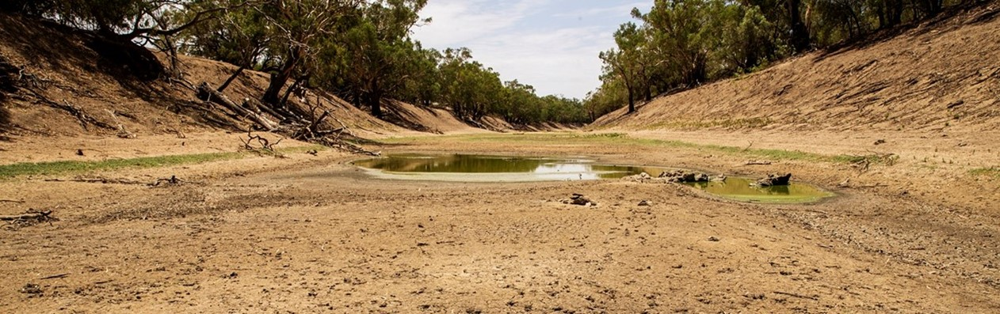

|image1|\ |image2|

I

|image3|

========
INFOSEQUIA - PUBLIC USER MANUAL
========

| Version: 0.1
| Document_No.: IS.PUM
| |copy| FutureWater

The latest version of this document can be found at
<https://pum-is.readthedocs.io/en/latest/usage.html>; You can contact the author via
e-mail at <s.contreras@futurewater.es>  

BAKCGROUND
============

Executive Summary
------------

Scope and Objectives
------------

Content of the document
------------

REVIEW OF USER REQUIREMENTS
============

SYSTEM ARCHITECTURE
============

General overview
------------

INFOSEQUIA - MONITORING
============

IS-MET Lot
------------

Lot content and general features
~~~~~~~~~~~~~~~~~
- List of Products
- Filename convention
- General Metadata and attributes

Input data and pre-processing
~~~~~~~~~~~~~~~~~
- CHIRPS
- ERA5-Land
- TerraClimate

PPERC product
~~~~~~~~~~~~~~~~~

Algorithm description
#################

Product specific metadata 
#################

Quality Assurance and Validation
#################

SPI product
~~~~~~~~~~~~~~~~~

Algorithm description
#################

Product specific metadata 
#################

Quality Assurance and Validation
#################

SPEI product
~~~~~~~~~~~~~~~~~

Algorithm description
#################

Product specific metadata 
#################

Quality Assurance and Validation
#################

IS-VH Lot
------------

Lot content and general features
~~~~~~~~~~~~~~~~~
- Overview
- List of Products (VH___, CVIA_)
- Filename convention
- General Metadata and attributes

The *IS.VH___* and *IS.CVIA_* products include a suite of drought precursors that inform about the health status of vegetation (VH = Vegetation Health) and the greeness dynamics of croplands along the growing season. The VH indices are computed following the VH method proposed by Kogan (1987) from two primary satellite-based indicators: the Normalized Difference Vegetation Index (NDVI), and the Land Surface Temperature (LST), while the CVIA index is based on the evolution of the NDVI seasonal trajectory. Gridded datasets of NDVI are computed from Red and NIR surface reflectance values from MODIS-Terra, OLCI-Sentinel-3 (for NDVI) and SLSTR-Sentinel-3 (for LST) products. Raw datasets are post-processed to denoise the NDVI, and to sharpen the spatial resolution of the NDVI and LST datasets, respectively. For the particular case of the SE3 products, and due to its short time coverage, a synthesis technique is additionally implemented to extend backward the NDVI and LST signals (at least until the same climatology period than for MODIS is covered). Both post-processed datasets, i.e. the denoised NDVI and sharpened LST, are the basis for computing: a) the suite of VH indices, including the Vegetation Condition Index (VCI), the Temperature Condition Index (TCI), and the Vegetation Health Index (VHI), and b) the Cumulative Vegetation Index Anomaly (CVIA). NDVI and LST precursors, and  VH and CVIA indices are computed at dekad (10-day) and monthly resolutions, and at different (1, 3, 6 and 12-month) aggregation timescales. Dekad products are used in InfoSequia for monitoring and visualization purposes, while monthly products are ingested in IS-4CAST processor as forecast predictors. 

Input data and pre-processing
~~~~~~~~~~~~~~~~~
- MOD09GQ (MODIS-Terra)
- OL_2_LFR (OLCI-SE3)
- SL_2_LST (SLSTR-SE3)

Ingestion of native datasets (only for SE3 products)
#################

Retrieval of quality-masked precursors
#################
- NDVI
- LST

NDVI denoising
#################

SE3 NDVI synthesis
#################

LST sharpening
#################

VH product suite
~~~~~~~~~~~~~~~~~

Algorithm description
#################

Product specific metadata 
#################

Quality Assurance and Validation
#################

CVIA product
~~~~~~~~~~~~~~~~~

Algorithm description
#################

Product specific metadata 
#################

Quality Assurance and Validation
#################

IS-HYD Product Suite
------------

Lot content and general features
~~~~~~~~~~~~~~~~~
- List of Products (WSTOR,...)
- Filename convention
- General Metadata and attributes

Input data and pre-processing
~~~~~~~~~~~~~~~~~
- S2MSI2A (MSI-SE2)

WSTOR product
~~~~~~~~~~~~~~~~~

Algorithm description
#################

Product specific metadata 
#################

Quality Assurance and Validation
#################

IS-CLI Product 
------------

Lot content and general features
~~~~~~~~~~~~~~~~~
- List of Products (IS.CLI)
- Filename convention
- General Metadata and attributes

Input data and pre-processing
~~~~~~~~~~~~~~~~~
- Indices from KNMI Climate Explorer
- Indices from PSL NOAA
- Indices from BoM

CLI product
~~~~~~~~~~~~~~~~~

Algorithm description
#################

Product specific metadata 
#################

Quality Assurance and Validation
#################

INFOSEQUIA - FORECASTING
============

INFOSEQUIA-4CAST Product Suite
------------

Lot content and general features
~~~~~~~~~~~~~~~~~
- List of Products (IS.4CAST.CY, IS.4CAST.WS)
- Filename convention
- General Metadata and attributes

Input data and pre-processing
~~~~~~~~~~~~~~~~~
- List of products from IS-MONITOR

4CAST.CY product
~~~~~~~~~~~~~~~~~

Algorithm description
#################

Product specific metadata 
#################

Quality Assurance and Validation
#################

4CAST.WS product
~~~~~~~~~~~~~~~~~

Algorithm description
#################

Product specific metadata 
#################

Quality Assurance and Validation
#################

PRODUCT USAGE
============

Basic usage
------------

Advanced usage
------------

.. |copy|   unicode:: U+000A9 .. COPYRIGHT SIGN

Revision history
----------------

======= ============= ===================== =========
Version Date of Issue Amendments by         Issued to
======= ============= ===================== =========
0.2     25-Feb-2022   InCubed Activity team ESA
0.3     05-Mar-2022   SC                    
\                                           
======= ============= ===================== =========

   
